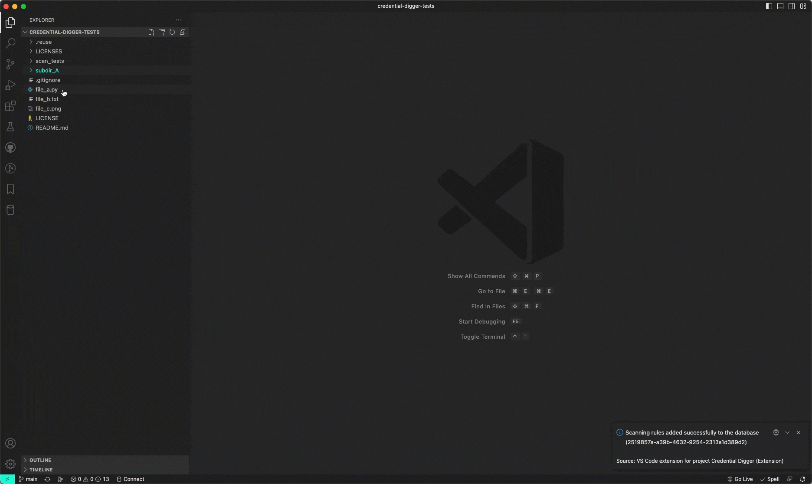
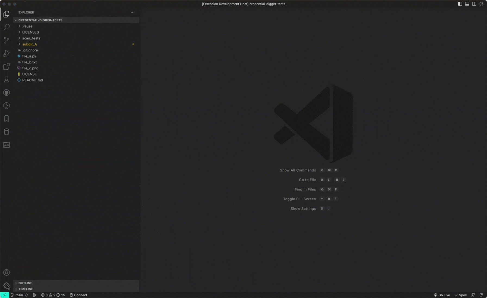
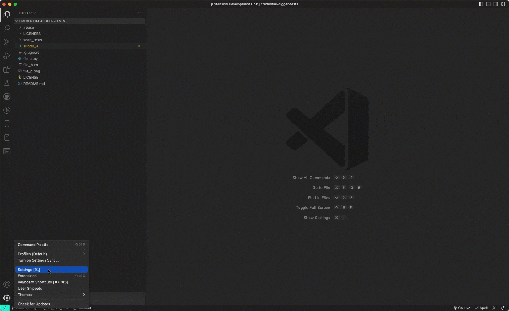
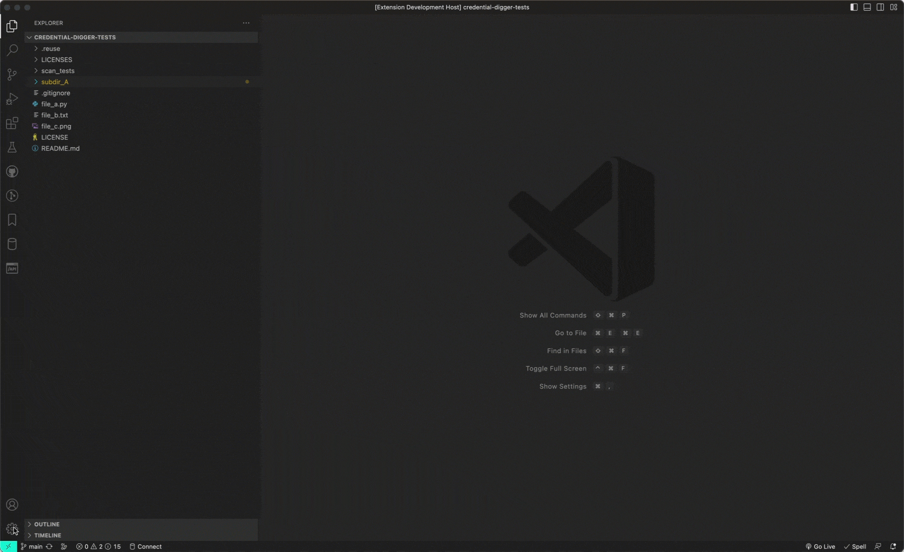

# VS Code extension for project Credential Digger

## Description

VS Code extension for project Credential Digger is a free IDE extension that let you detect secrets and credentials in your code before they get leaked! Like a spell checker, the extension scans your files using the [Credential Digger](https://github.com/SAP/credential-digger) and highlights the secrets as you write code, so you can fix them before the code is even committed.

### How it works

Open any source file, or edit an existing one and save, then you will start seeing the issues reported by the extension.
The issues are highlighted in your code as warnings, and also are listed in the `Problems` panel.

### Features

The tool provides the following support:

-   Connects to an instance of the Credential Digger running either
    -   locally
    -   in a docker container
    -   in a web server
-   Pushes the regular expressions rules to the Credential Digger via the command `Credential Digger: Add Rules`
-   Triggers the scan when opening/saving a file
-   Forces a scan of a file via the command `Credential Digger: Scan`
-   Highlights the findings in the code and displays them in the `Problems` panel as warnings

## Requirements

-   Credential Digger >= v4.11.1

## Download and Installation

The extension could be installed directly from the VS Code Marketplace!

## Configuration

### Credential Digger instance

The extension relies on an existing instance of the Credential Digger, hence you need to configure the extension based on the chosen mode

#### Local

#### Docker

#### Web Server

### Add rules

If your Credential digger instance does not have scanning rules or you want to provide your customized set then you can push them by running this command `Credential Digger: Add Rules`

## Support, Feedback, Contributing

This project is open to feature requests/suggestions, bug reports etc. via [GitHub issues](https://github.com/SAP/vs-code-extension-for-project-credential-digger/issues). Contribution and feedback are encouraged and always welcome. For more information about how to contribute, the project structure, as well as additional contribution information, see our [Contribution Guidelines](CONTRIBUTING.md).

## Code of Conduct

We as members, contributors, and leaders pledge to make participation in our community a harassment-free experience for everyone. By participating in this project, you agree to abide by its [Code of Conduct](CODE_OF_CONDUCT.md) at all times.

## Licensing

Copyright 2023 SAP SE or an SAP affiliate company and vs-code-extension-for-project-credential-digger contributors. Please see our [LICENSE](LICENSE) for copyright and license information. Detailed information including third-party components and their licensing/copyright information is available [via the REUSE tool](https://api.reuse.software/info/github.com/SAP/vs-code-extension-for-project-credential-digger).
