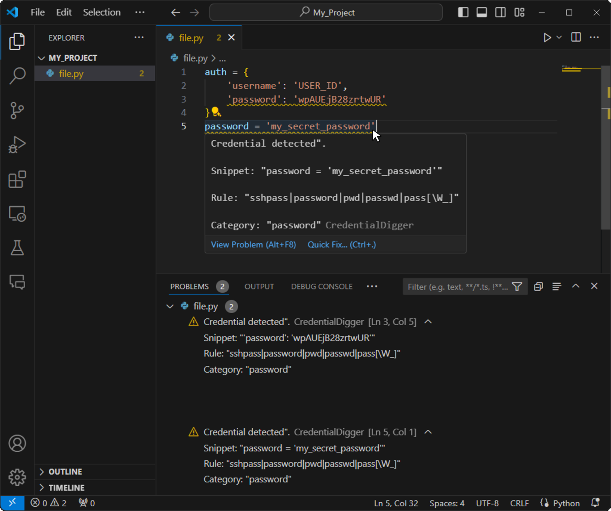
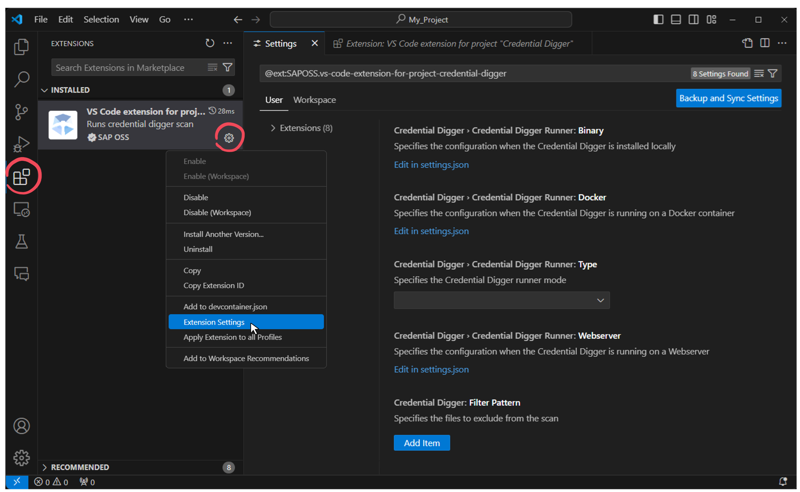
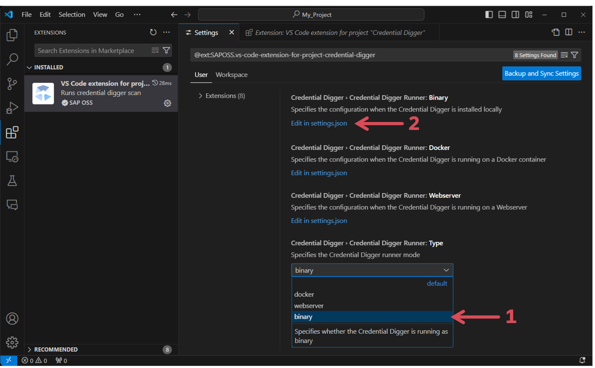
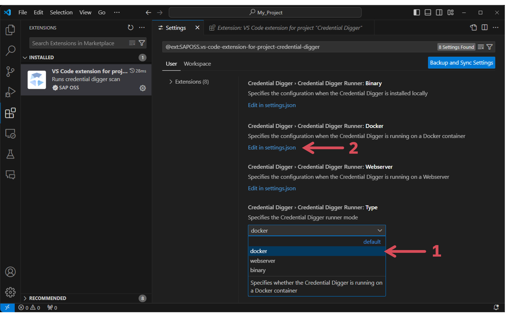
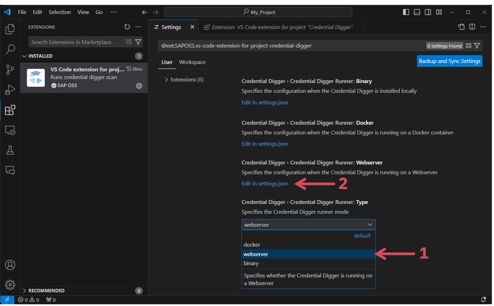
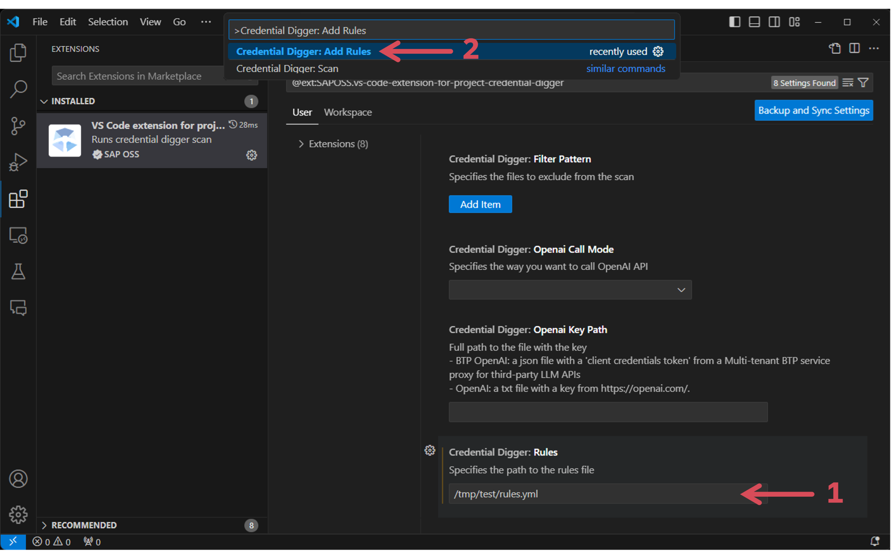
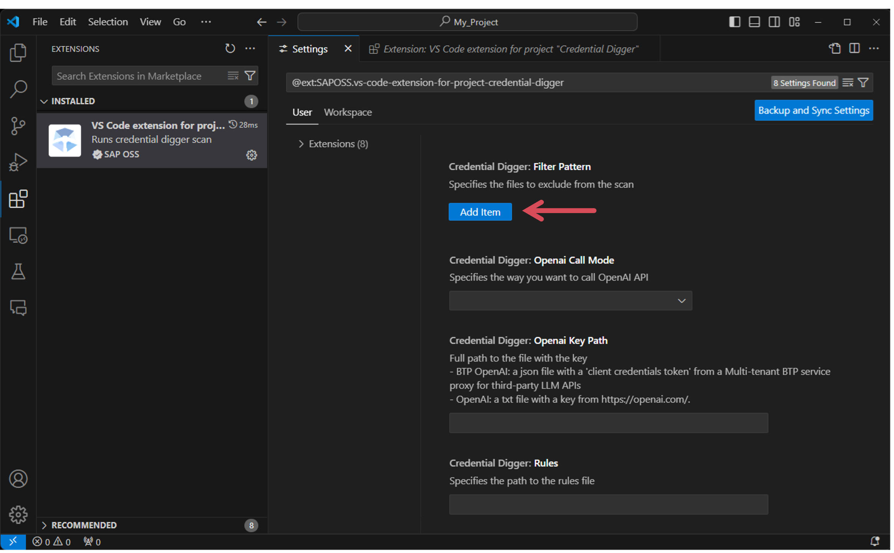
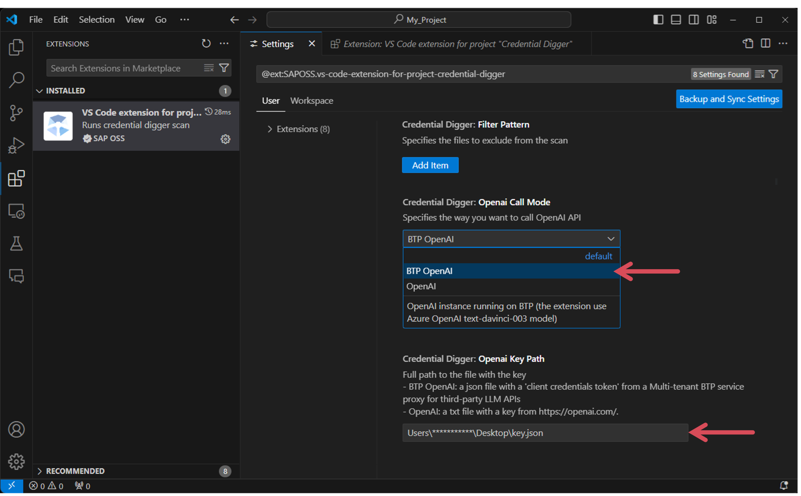
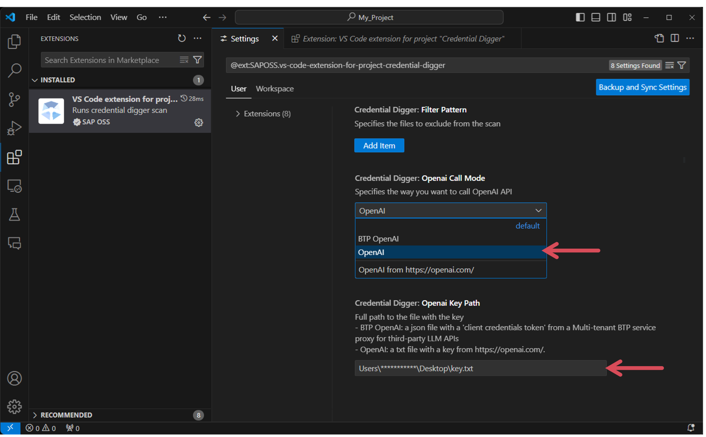

[](https://api.reuse.software/info/github.com/SAP/vs-code-extension-for-project-credential-digger)

# VS Code extension for project "Credential Digger"

## Description

VS Code extension for project "Credential Digger" is a free IDE extension that let you detect secrets and credentials in your code before they get leaked! Like a spell checker, the extension scans your files using the [Credential Digger](https://github.com/SAP/credential-digger) and highlights the secrets as you write code, so you can fix them before the code is even committed.

### How it works

<u>Open</u> any source file, or edit an existing one and <u>save</u>, then you will start seeing the issues reported by the extension.
The issues are highlighted in your code as warnings, and also are listed in the `Problems` panel.



### Features

The tool provides the following support:

-   Connects to an instance of the Credential Digger running either
    -   locally
    -   in a docker container
    -   in a web server
-   Pushes the regular expressions rules to the Credential Digger via the command `Credential Digger: Add Rules`
-   Triggers the scan when opening/saving a file
-   Forces a scan of a file via the command `Credential Digger: Scan`
-   Highlights the findings in the code and displays them in the `Problems` panel as warnings
-   Proposes three "quick fix" functionalities to address the secrets found in the code:

    -   <u>Quick Fix 1:</u> **Remove Secret** - Instantly remove the secret from your code, making cleanup tasks and revision simpler.
    -   <u>Quick Fix 2:</u> **Create Environment Variable** - With this feature, you can effortlessly store found secrets in a dedicated file and set up dependencies. This will be done automatically if your coding language is amongst Python, PHP, JavaScript, C#, or Java Maven. If your language is outside these five, you will receive AI-assisted advice to guide your manual setup.
    -   <u>Quick Fix 3:</u> **Secret Storage Options** - This feature provides three secret storage options, namely, BTP Secret Store, AWS Secret Manager, and Vault.

        -   For BTP Secret Store, the documentation is written mostly by us with a portion that is AI-generated.
        -   For AWS Secret Manager and Vault, the entire set of instructions is AI-generated to provide a comprehensive, dynamic and user-specific guide for securely storing secrets and integrating them into your project.

        (To fully benefit from the <u>AI functionality</u>, you need to configure some settings. Go to 'Configuration' section to have more information.)

These features aim to streamline your coding workflow, making it more efficient and secure.

## Requirements

-   Credential Digger >= v4.11.1

## Download and Installation

The extension could be installed directly from the [VS Code Marketplace](https://marketplace.visualstudio.com/items?itemName=SAPOSS.vs-code-extension-for-project-credential-digger)

## Configuration

### Credential Digger instance

The extension relies on an existing instance of the Credential Digger, hence you need to configure the extension based on the chosen mode



#### Local

Navigate to the extension settings first. Go to the `Type` section and select the `binary` option. Then, from the `Binary` section, click on `Edit in settings.json`.



Next, provide the required information as shown in the following example:

```
"credentialDigger.credentialDiggerRunner.type": "binary",
"credentialDigger.credentialDiggerRunner.binary": {
    "path": "/bin/credentialdigger",
    "databaseConfig": {
        "type": "postgres",
        "postgres": {
            "envFile": "/tmp/test/postgres/.env"
        }
    }
}
```

#### Docker

Navigate to the extension settings first. Go to the `Type` section and select the `docker` option. Then, from the `Docker` section, click on `Edit in settings.json`.



Next, provide the required information as shown in the following example:

```
"credentialDigger.credentialDiggerRunner.type": "docker",
"credentialDigger.credentialDiggerRunner.docker": {
    "containerId": "378ffa800494",
    "databaseConfig": {
        "type": "sqlite",
        "sqlite": {
            "filename": "/data/db/data.db"
        }
    }
}
```

#### Web Server

Navigate to the extension settings first. Go to the `Type` section and select the `webserver` option. Then, from the `Webserver` section, click on `Edit in settings.json`.



Next, provide the required information as shown in the following example:

```
"credentialDigger.credentialDiggerRunner.type": "webserver",
"credentialDigger.credentialDiggerRunner.webserver": {
    "host": "http://localhost:5000",
    "envFile": "/tmp/test/sqlite/.env"
}
```

### Add rules

If your Credential digger instance does not have scanning rules or you want to provide your customized set then you can first enter the path to your rules file into the `Rules` section and then push them by running this command `Credential Digger: Add Rules`



### Exclude files

If you would like to exclude some files from being scanned you need to configure the extension by providing the patterns to filter out

Click on `Add Item`:



Then, enter each pattern individually:


### OpenAI

To fully benefit from the AI functionality, you need to configure two fields.
(Your code will not be transmitted to an AI, only the file extension, like '.js' or '.java' will be used on the prompt.)

You have two AI modes at your disposal:

-   **BTP OpenAI**: This option is for a Multi-tenant BTP service proxy for third-party LLM APIs. The extension use Azure OpenAI gpt-4 model.
    -   Navigate to the `Openai Call Mode` section. From the dropdown menu, choose `BTP OpenAI`.
    -   Then navigate to the `Openai Key Path` section. Here, enter a path that leads to your key within a .json file.



-   **OpenAI**: This option is for OpenAI (https://platform.openai.com/)
    -   Navigate to the `Openai Call Mode` section. From the dropdown menu, choose `OpenAI`.
    -   Then navigate to the `Openai Key Path` section. Here, enter the path that directs to a .txt file. Make sure this file contains only the key you've copied and pasted.



## Support, Feedback, Contributing

This project is open to feature requests/suggestions, bug reports etc. via [GitHub issues](https://github.com/SAP/vs-code-extension-for-project-credential-digger/issues). Contribution and feedback are encouraged and always welcome. For more information about how to contribute, the project structure, as well as additional contribution information, see our [Contribution Guidelines](CONTRIBUTING.md).

## Code of Conduct

We as members, contributors, and leaders pledge to make participation in our community a harassment-free experience for everyone. By participating in this project, you agree to abide by its [Code of Conduct](CODE_OF_CONDUCT.md) at all times.

## Licensing

Copyright 2023 SAP SE or an SAP affiliate company and vs-code-extension-for-project-credential-digger contributors. Please see our [LICENSE](LICENSE) for copyright and license information. Detailed information including third-party components and their licensing/copyright information is available [via the REUSE tool](https://api.reuse.software/info/github.com/SAP/vs-code-extension-for-project-credential-digger).
